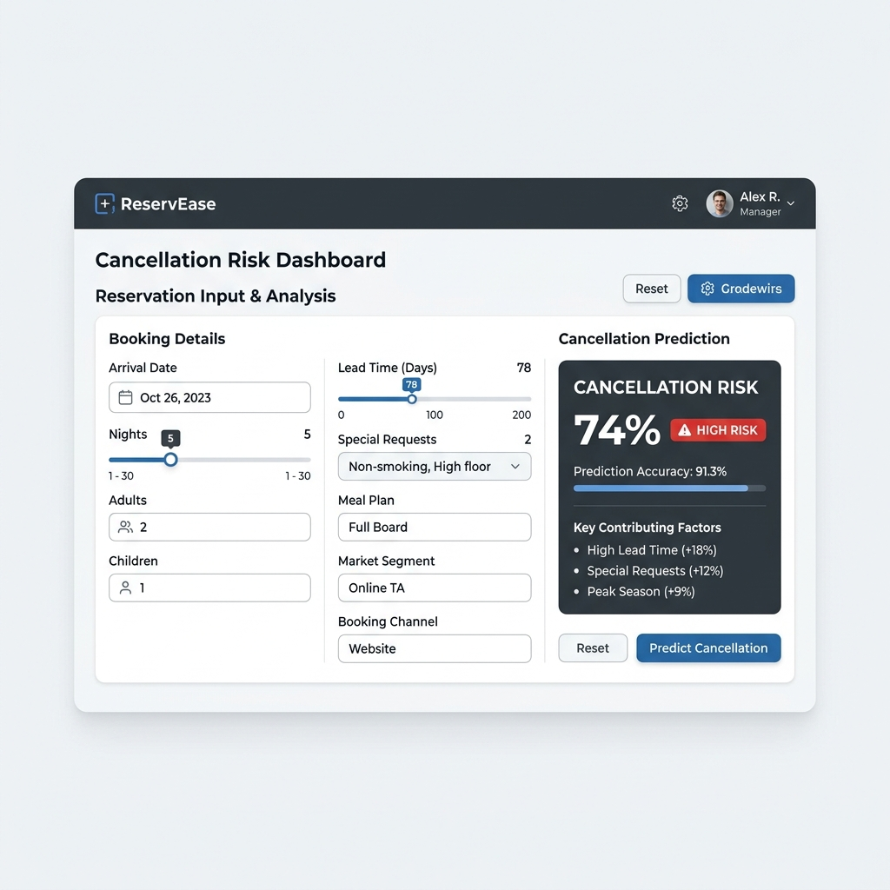
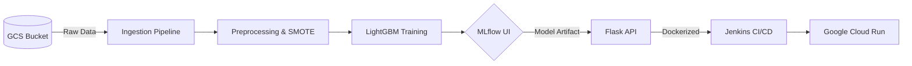

<div align="center">
  
  <h1>Hotel Reservation Cancellation Predictor</h1>
  <h3>End-to-End MLOps Pipeline & Production Deployment</h3>

  <p>
    
    
    
    
    
  </p>
</div>

---

## 📈 Dashboard Preview

*Professional UI for real-time reservation risk assessment.*

---

## 🏨 Business Value & Impact
Cancellations represent a major revenue leakage for the hospitality industry. This project provides a **predictive solution** to:
- **Minimize Revenue Loss**: Identify high-risk bookings early to optimize overbooking strategies.
- **Optimize Operations**: Better staff and resource allocation based on actual expected occupancy.
- **Dynamic Pricing**: Enable targeted marketing or flexible pricing for high-probability cancellations.

---

## ⚙️ MLOps Lifecycle Architecture
The system follows a robust industry-standard lifecycle from raw data to a scalable cloud endpoint:



---

## 🛠️ Essential Technical Features
- **Experiment Tracking**: Full lifecycle management using **MLflow** for hyperparameter tuning (`RandomizedSearchCV`) and artifact versioning.
- **Imbalanced Data Handling**: Implementation of **SMOTE** to handle class imbalance in reservation cancellations.
- **Scalable Deployment**: Fully containerized environment with **Docker**, orchestrated by a **Jenkins** CI/CD pipeline.
- **Cloud Infrastructure**: Serverless deployment on **Google Cloud Run** for high availability and auto-scaling.

---

## 📂 Project Structure
```text
├── application.py          # Flask entry point
├── pipeline/               # Orchestration scripts
├── src/                    # Core modular logic (Ingestion, Preprocessing, Training)
├── config/                 # YAML & Python configurations
├── templates/ & static/    # Modern UI resources
└── Dockerfile & Jenkinsfile # Infrastructure as Code
```

---

## 🚀 Essential Setup

### 1. Environment Preparation
```bash
python -m venv venv
# Activate: source venv/bin/activate (Unix) or venv\Scripts\activate (Windows)
pip install -e .
```

### 2. Execution Flow
- **Train Model**: `python pipeline/training_pipeline.py`
- **Track Experiments**: `mlflow ui` (Open http://localhost:5000)
- **Local Serve**: `python application.py` (Access http://localhost:8080)

---

## 👨‍💻 Author
**Mohamed EL Aouan**  
*Data Scientist & MLOps Architect*

---
*Developed as a professional portfolio demonstration of production-grade Machine Learning Engineering.*
